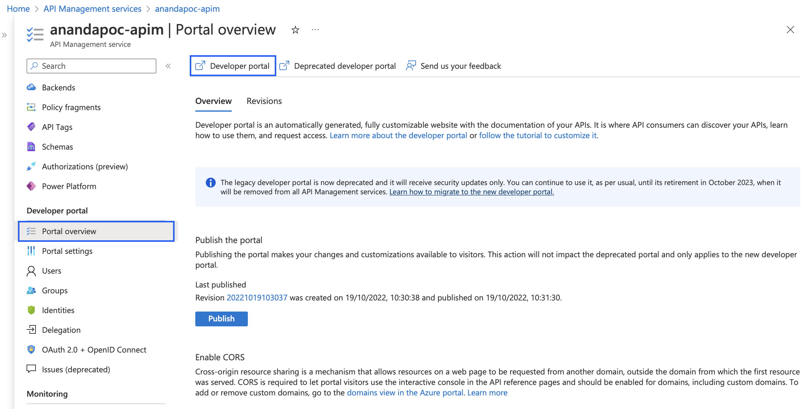

# APIM Development Portal

## Introduction

Azure API Management (APIM) offer capability for API providers to custom the developer portal for API consumer to get the APIs specification, and also able to try calling the API through that portal to see the request and response.

## Publish first developer portal

1. Login to Azure Portal and navigate to `Azure API Management` (or APIM) service and click on your APIM instance
2. Select menu `Portal overview` under `Developer portal` section
3. Click menu `Devloper portal` to launch the portal editor

4. In the editor mode, you can customize the UI of developer portal, e.g. logo, text, content.
5. Let's try to change something

6. At the moment, you still can access it as in editor mode since we have not yet publish it. Before we publish it, let enable CORS

7. On the `Portal overview` click `Enabled CORS`. Since the domain for your APIs and the domain name of the developer portal are different, we need to enable CORS in order to allow developer portal user to be able to call API via the developer portal (interactive)

8. Then click `Publish` to publish the first developer portal version

9. Test access the developer portal as anounymous. The URL is the same as the portal editor, but you need to logout the Azure session first. Recommend to use Chrom `Incognito` mode, or use another web browser to access it 

Example : https://anandapoc-apim.developer.azure-api.net/

Without login with user (access as anonymous), when you click Explore APIs, you will not see any thing

## User management

As you can see in the `Portal Overview` page, the last section of the page show that the user authentication with `Enable Azure AD` is not available for `Basic` tier

However, we still can use self-managed user account to protect our developer portal

1. Add Identity Providers, Select menu `Identities`, then click `+ Add`
2. On dropdown list, select `Username and password`, then click `Add`

3. Now, we can add new user by go to menu `Users` then click `+ Add`, then fill the user information, finally click `Add` to add the user

4. Using another web browser (or incognito) to open the developer portal and try to login to the portal using the user that you've just created

5. Test if we can explore any APIs. At this stage we can login to the developer portal but there is no APIs available for this user yet. Next step we have to add subscription to this account (please continue next step)

6. Add subscription to user, by go to menu `Users` then select user that you want to create subscription for, then select `Subscriptions`

7. In this page, you can add new subcription to that particular user, Click `+ Add subscription`, then fill the information (including the scope of subscription), then click `Create`

8. Go to Developer Portal and explore the API again, you should see the APIs in the product that you have granted to the subscriptions

 

## Get subscription keys

Ater administrator create/configure subscription for users, users are able to retrieve the subscription keys through the Developer Portal

1. Go to `Developer Portal` and login with user and credentials that you've created previously

2. Navigate to `Profile` and it should show the assigned subscription, user can click `Show` to display the masked subscription keys as plain text and can use it in thier API calls

 

## Test API (Interactive)

With Developer Portal, Besides the complete API specification, developers are also able to test the APIs to see how it actually works 

1. Open `Developer Portal` and login with user and credentials that you've created previously. 

2. Explore the API and select `Ananda APIM Demo API`, and click `Try It` 

3. The assigned subscription will be automatically selected and the header `Ocp-Apim-Subscription` will be automatically populated

4. For POST API, please fill in the request body according to specification or you can use the example that it's already provided, then Click `Send` to invoke the API

5. Check the result (HTTP Status Code, Response body, etc.)

 

## Configure Developer Portal for APIs which protected by OAuth2.0

In the previous exercise we have successfully configure the Developer Portal to be able to call APIs with and without `Subscription` 

However, in the realworld most of the APIs usually protected by OAuth 2.0. In this exercise we will configure Developer Portal to be able to call OAuth 2.0 protected APIs

*NOTE: Recommend to open 2 browser tabs for APIM and AAD*

**Prerequisites**
Ensure that the APIs have OAuth 2.0 configuration (`jwt_validation`)

 

### Add Application in AAD

*NOTE: These following steps are similar to previous topic (OAuth 2.0), with some small changes*
1. Open Azure Portal and navigate to Azure Active Directory
2. Click `App register`
3. Register new app with 
- Name: Developer Portal
- Single Tanent
- Redirect URL: Web (Platform) and `http://localhost:3000` (this redirect url is for temporary, we will come back and update this value again once we have the redirect url from APIM)

4. Copy `Application (Client) ID
5. Click `Client credential` to create client credentials, then copy the value of that credentials

6. Go back to `App registration` list and then click Application that we created for APIM

7. Click `Expose an API`, then `+ Add client application`
8. Input client ID from step 4, and select authorization scope `api://< apim app id >/Post.Read`

 

### Configure OAuth 2.0 in APIM

1. Open Azure Portal and navigate to APIM and select your instance
2. Click menu `OAuth 2.0 + OpenID Connect` and then click `+ Add` for `OAuth 2.0`

3. Fill the information and then click `Create`
- Display Name: Azure AD (Or any name)
- Id: < Auto generated >
- Client registration page URL: http://localhost:3000
- Authorization grant types: Authorization code
- Authorization endpoint URL: < From AAD > (See below)
- Authorization request method: Select `POST`
- Token endpoint URL: < From AAD > (See below)
- Client ID: < From AAD >
- Client Secret: < From AAD>

*NOTE: From AAD service, click `App registrations` and get this url from tab `Endpoints`

4. Before we click create `OAuth 2.0 Service`, please copy `Authorization code grant flow` (Redirect URL)

5. Open AAD and open the application that we've registered for Developer Portal and update the redirect URL to value that we copied previously

6. Update APIs in APIM `Settings` and in the `Security` Section
- Select OAuth 2.0
- Select the server that we have just created
- Override Scope: < From AAD >

### Test call API with OAuth 2.0

1. Open `Developer Portal` and then we will see the dropdown list for `Authorization`, select `authorization_code`. There will be the windows pop-ups for Azure Login.

2. Once the authentication completed, the header `Authorization` will be automatically populate with a valid token from Azure AD

3. Execute the API call and check the result

